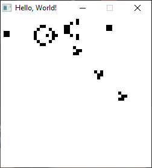

# Convey game using C and SDL2
Controls: Middle mouse button - start/stop simulation, left mouse button - draw (while stopped), right mouse button - step by step simulation (while stopped) 

 
Toolchain - mingw-w64-x86-64 (msys2)